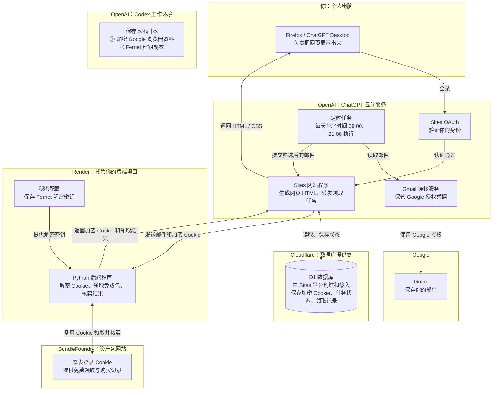

# BundleFoundry private automation

This owner-private ChatGPT Site uses platform OAuth for its browser and platform
service access for cloud tasks. It never receives Google passwords or provider
tokens. Native Gmail connector reads happen in the owner's cloud task, not through
identity-less Site connector invocation. Gmail profile must match the Render vault
account. Each notification is revalidated by the Render backend.

Each task obtains this Site's actual URL and supported service credential through
Sites get_site, searches native Gmail for
`from:news@bundlefoundry.com newer_than:7d -in:spam -in:trash`, reads the returned
MIME trees and native Gmail profile, POSTs `{source_account, messages}` to
`/api/update`, then reads `/api/status`. Pass platform service authorization only
to this Site. Never write or expose its value. Handle pagination in batches of 25.
Do not mark emails read or send email. No paid checkout is permitted.

The Site sends batches to a fixed Render machine endpoint authenticated with an
independent service key. Render verifies source account, sender/DMARC, destinations,
free availability and ownership after claiming. It returns an encrypted checkpoint
including renewed site cookies, deduplication and acceptance receipts; D1 persists
it across Render cold starts and restarts. Plain cookies and backend secrets are
never returned to the caller. Latest receipts and pending state can be read back.

On upstream transport failure, persist a recoverable error and do not retry the
mutation immediately. The next run checks ownership before attempting a new claim.
An atomic D1 lease prevents concurrent updates. Google may still revoke login.
The encrypted Google profile remains separate in the authorized login environment.

Timing is configured on the linked Sites automation, Asia/Taipei, twice daily.
Do not create duplicate schedules. Reuse this updater and this private Site.

## 服务主体与技术架构

每个大框标明负责的公司或平台，框内标明它保存什么、执行什么。
图中时间为台北时间（Asia/Taipei）。

加密 Cookie 存在 Cloudflare D1；解密密钥存在 Render 的秘密配置中。
数据库中的领取状态和结果快照受私有 Site 访问权限保护，会话检查点另行加密。
Codex 中的资料是本地保留副本，日常任务由云端定时服务和 Render 后端执行。
本公开目录只包含源码模板，不包含生产密钥、Cookie、浏览器资料或生产项目配置。
