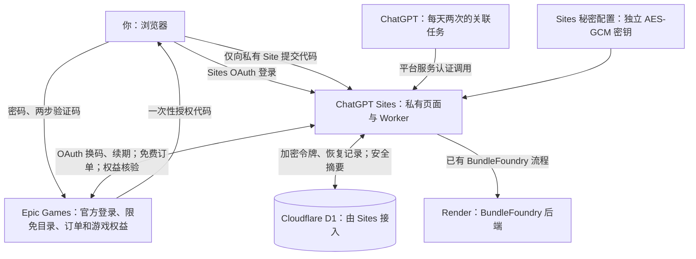

# Epic 每周免费游戏

Epic 与 BundleFoundry 复用同一个所有者私有的 ChatGPT Site 和每日两次的任务。
Epic 的 HTTP 请求直接由 Sites Worker 执行；Render 继续处理 BundleFoundry。
两种服务分别保存状态、凭据和运行锁，互不覆盖。

## 责任与凭据

| 主体 | 职责及保存的数据 |
| --- | --- |
| 用户的浏览器 | 显示 Sites 页面；打开 Epic 官方登录；将一次性授权代码提交给私有 Site |
| Epic Games | 验证密码与两步验证码、签发 OAuth 令牌、提供促销及账号权益、处理免费订单 |
| ChatGPT Sites | 用 Sites OAuth 限制所有者访问；运行 Worker；保管秘密运行时配置 |
| Sites 接入的 Cloudflare D1 | 保存 `epic_state` 加密令牌及订单恢复记录；保存不含令牌的 `epic_snapshot` 页面状态 |
| Sites 运行时秘密变量 | `EPIC_CREDENTIAL_KEY` 保存独立的 32 字节 AES-GCM 密钥；`EPIC_CLIENT_SECRET` 保存所选原生 OAuth 客户端的配置 |
| ChatGPT 关联任务 | 每日台北时间 09:00、21:00 调用两项服务；页面关闭时仍可运行 |
| Render | 仅处理已有 BundleFoundry 任务；不会收到 Epic 代码、令牌或密钥 |

Epic 密码、两步验证码不提交给本站。一次性代码只在请求期间用于换取令牌，不写入数据库。
浏览器不接收访问令牌、刷新令牌或解密密钥；页面不使用 localStorage 保存凭据。
密文采用 AES-256-GCM、每次随机 96 位 IV 和固定的服务/版本附加认证数据。
Epic 密钥不复用 BundleFoundry 的 Fernet 密钥，不进入公开 GitHub 或 hosting manifest。
密钥与数据库虽分开配置，Sites 运行时具有解密能力；本方案不是对运行时运营方不可解密的端到端加密。

## 部署及授权

1. 使用现有私有 Site 的真实项目 ID，保留所有者 ACL、D1 绑定和原有配置，不创建公开登录入口。
2. 在 Sites 设置秘密 `EPIC_CREDENTIAL_KEY`（`openssl rand -base64 32`）及 `EPIC_CLIENT_SECRET`。
   保留密钥以便解密既有状态；不可在每次部署时重新生成。
   当前使用公开分发的 Epic 原生 Launcher 客户端 ID；它不是项目专属 OAuth 注册。
   客户端配置变动时需跟进更新，不能保证其为稳定的官方商店自动领取 API。
3. `npm test` 后在独立私有 checkout 中 `npm run build`；推送精确源码并发布同一私有 Site。
   构建将 Worker、`epic.js` 与 `ui.js` 打包为单个 Worker 入口，避免云端遗漏依赖模块。
4. 在私有页面点击“打开 Epic 官方登录”，登录后将官方返回的 `authorizationCode` 或包含它的 JSON
   粘贴进本站。代码会从输入框立即清除；换码后显示 Epic 账号名称和实际国家。
5. 更新现有的关联任务，在 BundleFoundry 步骤之外独立执行下列 Epic 步骤；任一服务失败不取消另一项服务。

API 全部位于私有 Sites dispatch 后。`POST /api/epic/connect` 与 `/api/epic/disconnect`
额外要求 Sites 注入的完整所有者身份、同源 Origin 和 JSON 请求，拒绝仅有平台服务权限的调用。
不要在公开后端信任这些身份头，也不要绕过 Sites 边界暴露这个 Worker。

任务通过 fresh `get_site` 获取实际 URL 和平台服务认证；向该 Site 的 `/api/epic/run`
发送 JSON `{}`，随后 GET `/api/epic/status` 回读。
只向此 Site 发送 `OAI-Sites-Authorization`，不在任务提示或日志中保存其值。
Epic 步骤不读取 Gmail，也不改变每天两次的邮箱检查频率。

## 每次运行与技术限制

- 未连接时只展示台湾地区的公开限免预览。连接后按 Epic 官方账号国家查询当前有效促销，
  只接受原价大于零、现价为零、仍在促销窗口内的基础游戏，排除 DLC、未来促销与永久免费游戏。
- 每次运行先更新刷新令牌，再原子保存加密状态，然后读取账号资料和游戏权益。
  使用 Epic 返回的真实令牌到期时间，不能人为改为一个月。
  如果刷新有效期不足 13 小时，私有页面显示警告；需要根据实测增加独立续期任务，不能擅自增加 Gmail 检查次数。
- 已拥有的游戏不提交订单。订单预览必须匹配账号、国家、namespace 和唯一 offer，
  且明确 `isFree=true`，总额、钱包支付和其他支付金额均为数值零；税费或手续费有值时也必须为零。
  缺失字段、字符串金额或任何非零项都停止；不选付款方式、不调用 quickPurchase。
- 免费确认前先保存 pending journal。确认后读取该账号的 ACTIVE、未过期权益，并核实全部目标 catalog item。
  HTTP 200 不能证明已入库。断线后的下次运行先核实 pending；没有入库时保留“订单待核实”，不自动重复提交。
- API 请求只指向固定 Epic HTTPS 主机，不自动跟随重定向；请求和整次运行有时间上限。
  D1 原子 lease 防止网页与定时任务同时更新凭据或重复提交。
- CAPTCHA、协议、年龄、家长控制、地区限制或新版动态结账页需要人工处理时，显示对应状态。
  不伪造年龄、不自动接受新增协议、不使用验证码破解或反检测工具。
  官方验证后可重新授权；不确定订单应先在 Epic 官网核实或手动完成，再让本站核验入库。

原生 OAuth 与权益读取参照 [Legendary](https://github.com/derrod/legendary)，
订单协议参照 [node-epicgames-client](https://github.com/Revadike/node-epicgames-client)。
内部商店结账协议可能发生变化；当前实现严格拒绝未知订单结构，须在真实账号授权后核实兼容性。
若云端被要求使用完整交互式结账，应另实现由私有 Sites OAuth 保护的浏览器流程，不能把公开共享令牌页面作为替代。

## 验收

必须在真实部署上完整完成：发现该账号尚未拥有的本周限免游戏 → 匹配的零金额订单 →
该账号目标游戏 ACTIVE 权益 → D1 保存并能回读验收记录 → 重启后不重复提交。
`already_owned`、测试夹具、公开促销查询、服务上线和关联任务启用都不替代新领取验收。
未授权时 `project_acceptance_complete=false`；遇到验证或订单结构变化时如实报告，不能宣称领取完成。
