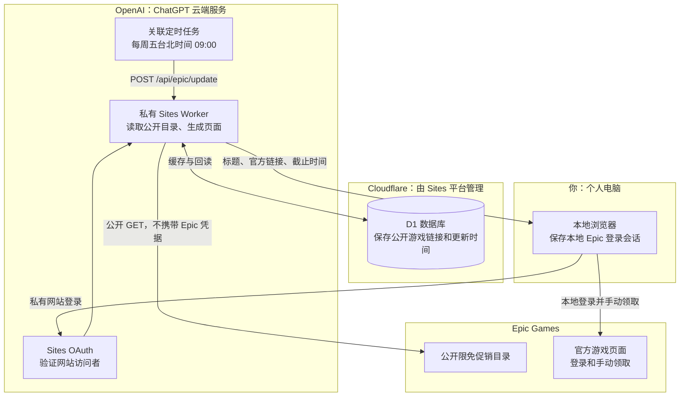

# Epic 每周免费游戏链接

Epic 已改为公开目录更新服务。每周五台北时间 09:00 更新当前限免游戏的标题、官方页面链接、开始时间及截止时间。用户在本地浏览器打开链接，使用自己的 Epic 登录会话手动领取。页面也提供“更新游戏链接”按钮。

## 主体与数据流

该 Epic 链路不使用 Render、Gmail、Google 凭据、Epic OAuth 令牌或 Cookie。BundleFoundry 仍在每天台北时间 09:00、21:00 经 Gmail 和 Render 自动领取资产包，两项任务独立。

## API 与存储

- `POST /api/epic/update`：JSON 正文 `{}`，从固定 Epic HTTPS 公开目录读取台湾地区预览。
- `GET /api/epic/status`：回读 `mode: manual`、更新时间及当前有效游戏链接。
- 旧 `POST /api/epic/run` 仅作为公开目录更新别名，不进行账号或领取操作。
- 旧连接、导入、断开、续期入口返回 `410 epic_automation_disabled`；Epic 本地 Cookie 导出脚本和 Render Epic 网站会话入口已移除。

D1 使用新的 `epic_links_snapshot`、`epic_links_error`、`epic_links_lease` 键。保存的数据不包含用户账号或登录凭据。更新失败保留上次缓存，页面标出失败；过期限免会在读取时隐藏。独立原子 lease 防止并发更新，不影响 BundleFoundry lease 或 checkpoint。

既有 Epic 加密状态及其独立密钥未删除，但不再被程序读取、解密、续期或使用。它们是停用的历史资料；改变方案不等于撤销 Epic 官方账号授权。历史资料清理及官方授权撤销应另行处理，不能把删除密钥误报为撤销授权。

## 免费筛选与链接

只展示当前促销窗口内、原价大于零且折后价明确为零的基础游戏或游戏合集；排除付费、永久免费、未来促销和附加内容。优先采用官方 offer mapping 的产品路径，其次 catalog mapping、产品 slug。路径仅允许字母、数字和连字符，链接始终指向 `https://store.epicgames.com/zh-Hant/`。目录缺少有效产品路径时明确提供官方限免目录入口，不猜测游戏地址。

免费资格与时间以 Epic 官网和用户账号地区为准；台湾公开目录不能代表其他地区账号，也不能证明用户已经拥有游戏。

## 调度与验收

复用已有 Site 关联每周任务，不创建重复任务。每次先通过 Sites `get_site` 取得当前私有 URL 和平台服务访问凭据，调用更新 API，再回读确认持久结果。任务不读取 Gmail，也不使用 Epic 账号授权。平台服务凭据只发送给对应私有 Site，不写入提示、源码或日志。

新的交付条件为：公开促销筛选 → 保存真实官方页面链接及截止时间 → Site 回读一致 → 私有页面可打开本地领取链接 → 每周更新任务已启用。旧的“自动领取本周两款并核实权益”验收条件已取消。该服务不会声称游戏已领取或核验游戏库。

运行 `npm test` 检查免费筛选、链接约束、停用旧授权接口、无凭据公开请求、缓存保留、并发控制和页面行为。
