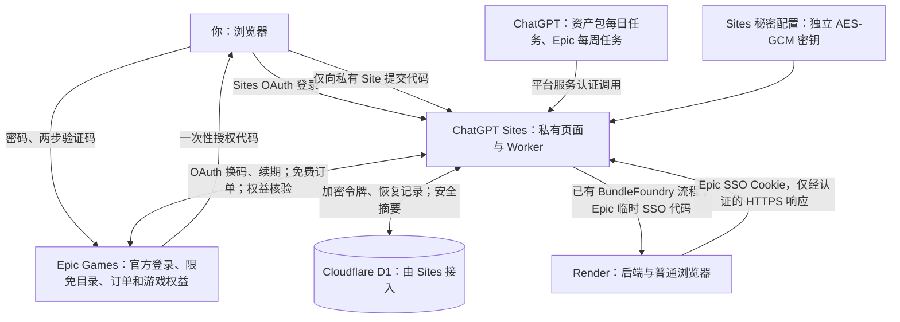

# Epic 每周免费游戏

Epic 与 BundleFoundry 复用同一个所有者私有的 ChatGPT Site，使用不同的领取定时任务。
Epic 的账号、续期、订单和权益 HTTP 请求由 Sites Worker 执行；
需要网站登录会话时，可由现有 Render 后端的普通 Chromium 处理官方单次 SSO。
两种服务分别保存状态、凭据和运行锁，互不覆盖。

## 责任与凭据

| 主体 | 职责及保存的数据 |
| --- | --- |
| 用户的浏览器 | 显示 Sites 页面；打开 Epic 官方登录；将一次性授权代码提交给私有 Site |
| Epic Games | 验证密码与两步验证码、签发 OAuth 令牌、提供促销及账号权益、处理免费订单 |
| ChatGPT Sites | 用 Sites OAuth 限制所有者访问；运行 Worker；保管秘密运行时配置 |
| Sites 接入的 Cloudflare D1 | 保存 `epic_state` 加密令牌及订单恢复记录；保存不含令牌的 `epic_snapshot` 页面状态 |
| Sites 运行时秘密变量 | `EPIC_CREDENTIAL_KEY` 保存独立的 32 字节 AES-GCM 密钥；`EPIC_CLIENT_SECRET` 保存所选原生 OAuth 客户端的配置 |
| ChatGPT 关联任务 | 资产包每日台北时间 09:00、21:00；Epic 每周五 09:00；每日任务只为 Epic 续期凭据 |
| Render | 处理 BundleFoundry；Epic 单次 SSO 后备浏览器只收到临时 exchange code，短暂处理 Cookie，不接收刷新令牌或 Epic 解密密钥 |

Epic 密码、两步验证码不提交给本站。一次性代码只在请求期间用于换取令牌，不写入数据库。
浏览器不接收访问令牌、刷新令牌或解密密钥；页面不使用 localStorage 保存凭据。
密文采用 AES-256-GCM、每次随机 96 位 IV 和固定的服务/版本附加认证数据。
Epic 密钥不复用 BundleFoundry 的 Fernet 密钥，不进入公开 GitHub 或 hosting manifest。
运行时非秘密配置 `EPIC_ACCEPTANCE_TARGETS` 固定本次验收的游戏 offer、namespace、catalog item 和限免结束时间，
防止下周的其他游戏被误计入本周验收；该配置不含账户或凭据。
密钥与数据库虽分开配置，Sites 运行时具有解密能力；本方案不是对运行时运营方不可解密的端到端加密。

## 部署及授权

1. 使用现有私有 Site 的真实项目 ID，保留所有者 ACL、D1 绑定和原有配置，不创建公开登录入口。
2. 在 Sites 设置秘密 `EPIC_CREDENTIAL_KEY`（`openssl rand -base64 32`）及 `EPIC_CLIENT_SECRET`。
   保留密钥以便解密既有状态；不可在每次部署时重新生成。
   当前使用公开分发的 Epic 原生 Launcher 客户端 ID；它不是项目专属 OAuth 注册。
   客户端配置变动时需跟进更新，不能保证其为稳定的官方商店自动领取 API。
3. `npm test` 后在独立私有 checkout 中 `npm run build`；推送精确源码并发布同一私有 Site。
   构建将 Worker、`epic.js` 与 `ui.js` 打包为单个 Worker 入口，避免云端遗漏依赖模块。
4. 在私有页面点击“打开 Epic 官方登录”，登录后将官方返回的 `authorizationCode` 或包含它的 JSON
   粘贴进本站。代码会从输入框立即清除；换码后显示 Epic 账号名称和实际国家。
5. 保持 BundleFoundry 每日两次的关联任务，只追加 Epic 凭据续期；另外建立 Epic 每周五 09:00 的独立领取任务，不能在每日任务中领取 Epic 游戏。

### “重新授权 Epic”窗口

窗口说明刷新令牌的自动续期与重新授权步骤，并提供 Epic 官方登录链接。
浏览器已有的 Epic Cookie 可以让官网复用登录，但受同源限制，私有 Site 无法直接读取该 Cookie。
本站的后端复用 D1 中已经加密保存的 Epic 访问、刷新令牌及网站会话 Cookie。
用户只需在令牌失效、授权被撤销或官方要求验证时，立即把新的单次授权码提交到窗口。
成功兑换后才原子替换旧会话，授权码不写入数据库；令牌以 AES-256-GCM 加密保存。
提交后立即开始当期免费领取及权益核验，输入框在提交和窗口关闭时清空，错误信息显示在窗口内。
已过期或被使用的授权码返回“授权代码已过期或无效”，需要重新生成，不重复兑换旧代码。

状态中的 `failure_stage` 仅保存失败环节（续期、账号、促销、权益或结账），不保存请求或令牌。
`failure_detail` 只保存固定操作名、HTTP 状态和经过格式检查的 Epic 错误代码，不保存 URL 查询、响应正文或 Cookie。
保存过会话不表示凭据仍有效；成功续期和账号权益查询后可恢复之前的登录错误，
结账失败仍需按实际环节处理，不能把全部失败误判为需要重新授权。

### 网站会话后备浏览器

Sites 用现有访问令牌向 Epic 获取单次 exchange code，调用官方 `/id/exchange` 建立网站 Cookie。
若 Sites 的普通 HTTP 请求在该入口收到 403，则获取新的单次代码，经独立机器密钥认证的
HTTPS 请求交给 Render `/internal/epic/web-session`。这不是用户登录入口，不提供网页、截图、
远程桌面或共享令牌链接；公开 Render 不信任 Sites 用户身份头。
Render 启动没有用户资料的标准 Chromium，访问固定 Epic 官方 SSO，遇到登录、验证或限制即停止。
不使用反检测参数、验证码破解，也不填写密码、验证码、年龄或新增协议。
浏览器关闭后只返回作用域为 Epic 的 Cookie，Render 不保存 Cookie 或浏览器资料。
Sites 验证 Cookie 作用域和大小，并与 Epic 状态一起用独立 AES-GCM 密钥加密保存到 D1；
Cookie 按 Epic 签发的有效期复用，不强行延长到一个月。

API 全部位于私有 Sites dispatch 后。`POST /api/epic/connect` 与 `/api/epic/disconnect`
额外要求 Sites 注入的完整所有者身份、同源 Origin 和 JSON 请求，拒绝仅有平台服务权限的调用。
不要在公开后端信任这些身份头，也不要绕过 Sites 边界暴露这个 Worker。

任务通过 fresh `get_site` 获取实际 URL 和平台服务认证；向该 Site 的 `/api/epic/run`
发送 JSON `{}`，随后 GET `/api/epic/status` 回读。
只向此 Site 发送 `OAI-Sites-Authorization`，不在任务提示或日志中保存其值。
Epic 每周领取步骤不读取 Gmail，也不改变每天两次的邮箱检查频率。每日任务另外 POST `/api/epic/refresh` 发送 `{}`，只轮换并加密保存令牌，不查询促销、不提交订单。两种 Epic 操作共用同一个 lease，防止周五 09:00 并发；冲突时等另一项操作完成再运行，不重复提交订单。

## 每次运行与技术限制

- 未连接时只展示台湾地区的公开限免预览。连接后按 Epic 官方账号国家查询当前有效促销，
  只接受原价大于零、现价为零、仍在促销窗口内的基础游戏，排除 DLC、未来促销与永久免费游戏。
- 每周领取先更新刷新令牌，再原子保存加密状态，然后读取账号资料和游戏权益；每日仅续期的入口不调用游戏或订单接口。
  使用 Epic 返回的真实令牌到期时间，不能人为改为一个月。
  如果刷新有效期不足 13 小时，私有页面显示警告；需要根据实测增加独立续期任务，不能擅自增加 Gmail 检查次数。
- 已拥有的游戏不提交订单。订单预览必须匹配账号、国家、namespace 和唯一 offer，
  且明确 `isFree=true`，总额、钱包支付和其他支付金额均为数值零；税费或手续费有值时也必须为零。
  缺失字段、字符串金额或任何非零项都停止；不选付款方式、不调用 quickPurchase。
- 免费确认前先保存 pending journal。确认后读取该账号的 ACTIVE、未过期权益，并核实全部目标 catalog item。
  HTTP 200 不能证明已入库。断线后的下次运行先核实 pending；没有入库时保留“订单待核实”，不自动重复提交。
- API 请求只指向固定 Epic HTTPS 主机，不自动跟随重定向；请求和整次运行有时间上限。
  D1 原子 lease 防止网页与定时任务同时更新凭据或重复提交。
- CAPTCHA、协议、年龄、家长控制、地区限制或新版动态结账页需要人工处理时，显示对应状态。
  不伪造年龄、不自动接受新增协议、不使用验证码破解或反检测工具。
  官方验证后可重新授权；不确定订单应先在 Epic 官网核实或手动完成，再让本站核验入库。

原生 OAuth 与权益读取参照 [Legendary](https://github.com/derrod/legendary)，
订单协议参照 [node-epicgames-client](https://github.com/Revadike/node-epicgames-client)。
内部商店结账协议可能发生变化；当前实现严格拒绝未知订单结构，须在真实账号授权后核实兼容性。
原有 UE Launcher 购买入口已重定向至 Unreal Engine；实现使用固定的 Epic Payment purchase 页面获取订单 nonce，
继续由经过授权的预览、确认接口及账号权益核验决定结果。尚未取得真实 Epic 授权时，不能把该接口的兼容性当作已验证。
若云端被要求使用完整交互式结账，应另实现由私有 Sites OAuth 保护的浏览器流程，不能把公开共享令牌页面作为替代。

云端预览验证曾发现 Node 与 Worker 原生 `fetch` 的接收者要求不同：把函数保存在实例上直接调用时，
Worker 请求会失败。现通过 `fetcher.call(globalThis, ...)` 调用，并在测试中检查接收者。
部署后已验证无账号授权的云端限免查询、D1 写入与回读，以及匿名请求和服务身份修改凭据的拒绝结果。
这些检查证明部署和查询可用，不代表已完成真实账号新领取。

## 验收

本次终止条件是两个固定目标 **System Shock 2: 25th Anniversary Remaster** 与 **BURIED STARS**
都由系统自动新领取，并确认进入同一 Epic 账号的游戏库；这两款的本期限免于台北时间 2026-10-08 23:00 结束。
验收在授权后立即执行，不等待周五的例行任务。
对每个目标必须完成：发现该账号尚未拥有 → 匹配的零金额订单预览 → Epic 确认订单响应 →
该账号目标游戏 ACTIVE 权益 → D1 保存并能回读验收记录 → 重启后不重复提交。
`acceptance_progress.completed_count` 只统计同时保存免费检查、订单确认和权益证据的固定目标。
只领取一款时是 1/2，`project_acceptance_complete=false`；两款均完成才为 true。
`already_owned`、测试夹具、公开促销查询、服务上线和关联任务启用都不替代新领取验收。
未授权时 `project_acceptance_complete=false`；遇到验证或订单结构变化时如实报告，不能宣称领取完成。
如果确认订单的响应丢失，后续即使发现已拥有，也只记为 `ownership_verified_unconfirmed`，
不能仅凭之后的持有状态把人工领取或不确定提交算成自动领取验收。
